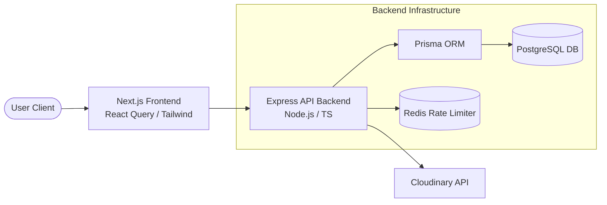
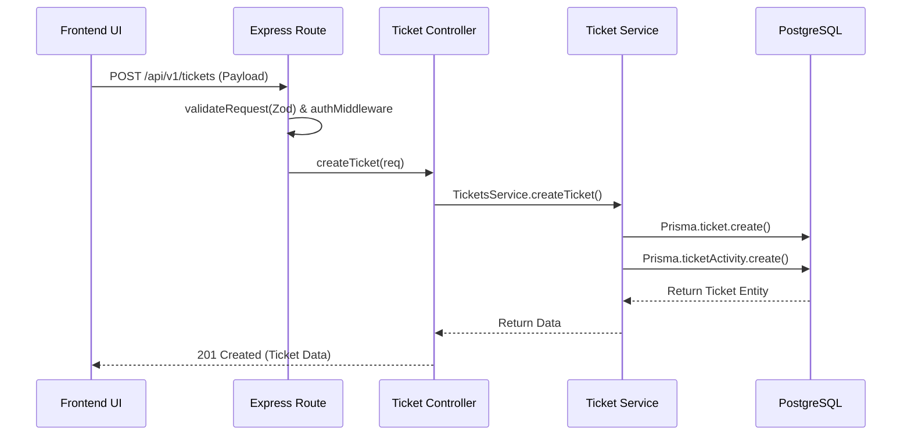

# High-Level Design (HLD)
**Project:** Customer Support Ticket Management System (CSTMS)

## 1. System Overview
The Customer Support Ticket Management System (CSTMS) is an enterprise application designed to facilitate communication between customers and support agents. The system utilizes a modern Backend-for-Frontend (BFF) approach, integrating a React-based Next.js frontend with an Express/Node.js backend, backed by PostgreSQL and Redis.

## 2. Architecture
The system employs a **Backend-for-Frontend (BFF) combined with Layered Monolithic Architecture**. 
- The Next.js application acts as the client-side presentation layer and frontend server.
- The Node.js/Express application acts as the backend API layer.
- The backend internals strictly follow a layered pattern: `Routes -> Controllers -> Services -> Data Access (Prisma)`.

## 3. System Architecture Diagram

## 4. Component Architecture
- **Frontend (web/):** Next.js App Router providing server-rendered pages and client-side interactivity. Forms are handled via `react-hook-form` and `zod`. State management and optimistic UI updates are managed by `@tanstack/react-query`.
- **Backend API (src/):** Express.js API handling business logic, validation, and authorization.
- **Database (prisma/):** PostgreSQL serves as the primary source of truth, managed via Prisma migrations.
- **External Services:** 
  - **Cloudinary:** Used for storing ticket attachments and user uploads.
  - **Redis:** Used via `rate-limiter-flexible` to protect authentication endpoints.

## 5. Data Flow
**Ticket Creation Flow:**

## 6. Module Architecture (Backend)
- **Auth Module (`src/modules/auth`):** Handles user registration, login, JWT issuance, and token refresh logic.
- **Users Module (`src/modules/users`):** Handles user profile retrieval, agent listing, and admin-level user CRUD operations.
- **Tickets Module (`src/modules/tickets`):** The core domain. Handles the ticket lifecycle, status updates, assignment, replies, attachments, and audit logging.
- **Analytics Module (`src/modules/analytics`):** Aggregates data for the admin dashboard (e.g., ticket volume, status distribution, workload).

## 7. Database Architecture
The application uses PostgreSQL with Prisma ORM.

**Core Entities:**
- **User:** Primary identity record. Contains `role` enum (ADMIN, AGENT, CUSTOMER).
- **Session:** Tracks refresh tokens.
- **Ticket:** The primary domain entity. Contains foreign keys to `User` (Customer) and `User` (Assignee). Tracks `status` and `priority`.
- **TicketReply:** Threaded messages tied to a Ticket and User.
- **TicketActivity:** An audit log entity recording state changes.
- **Attachment:** File metadata tied to a Ticket or TicketReply.

## 8. API Architecture
The API strictly adheres to REST principles, versioned under `/api/v1/`.
- `/api/v1/auth/*`: Public routes for authentication.
- `/api/v1/users/*`: Protected routes for user management.
- `/api/v1/tickets/*`: Protected routes for ticket operations.
- `/api/v1/analytics/*`: Protected, admin-only routes for reporting.

## 9. Authentication and Authorization
**Authentication Lifecycle:**
1. User logs in.
2. `AuthController` validates credentials against bcrypt hash in DB. [Evidence: `src/modules/auth/auth.controller.ts`]
3. Backend generates a short-lived JWT (Access Token) and long-lived Refresh Token.
4. Client provides Access Token via `Authorization: Bearer <token>` header on subsequent requests.

**Authorization:**
The backend utilizes a `requireRole` middleware that checks the role embedded in the decoded JWT against an allowed list of roles. [Evidence: `src/core/middlewares/requireAuth.ts`]

## 10. Security Architecture
- **JWT Authentication:** Stateless, signed tokens ensure request integrity.
- **Password Hashing:** Passwords are never stored in plaintext (Bcrypt is utilized).
- **Rate Limiting:** Protects the auth routes against brute-force attacks via Redis and `rate-limiter-flexible`. [Evidence: `src/modules/auth/auth.routes.ts`]
- **Input Validation:** All requests pass through Zod schema validation middleware before reaching controllers.
- **Security Headers:** Express uses `helmet` for basic HTTP security headers.

## 11. Deployment Architecture
The repository provides a `docker-compose.yml` for provisioning a local PostgreSQL and Redis instance. A production deployment architecture (e.g., Kubernetes, AWS ECS) could not be verified from the repository. The frontend Next.js app and Node.js backend are intended to be deployed as separate services.

## 12. Scalability
- **Current Scalability:** The backend is stateless (sessions are DB-backed via Refresh tokens, Access tokens are JWT), allowing horizontal scaling of the Node process.
- **Bottlenecks:** Attachment streaming through the Node backend might become a bottleneck under heavy load; direct-to-S3/Cloudinary uploads from the client would be a better scaling strategy.

## 13. Reliability and Error Handling
- The backend utilizes a centralized `errorHandler.ts` middleware. Controller functions catch exceptions and pass them to `next(error)`.
- Custom error classes (`AppError`, `NotFoundError`, `BadRequestError`) map to standard HTTP status codes. [Evidence: `src/core/errors/AppError.ts`]
- The frontend utilizes global `error.tsx` boundaries to catch rendering failures gracefully.

## 14. Technology Decisions
- **Next.js & React Query:** Chosen for the frontend to enable SEO-friendly SSR where needed, while maintaining highly interactive client-side fetching with automatic caching and optimistic updates.
- **Express & Node.js:** Provides a lightweight, highly customizable API layer.
- **Prisma & PostgreSQL:** Prisma provides exceptional TypeScript safety bridging the gap between Node.js and SQL, preventing runtime mapping errors.
- **Cloudinary:** Used for attachment storage to offload file hosting and bandwidth from the primary API server.
