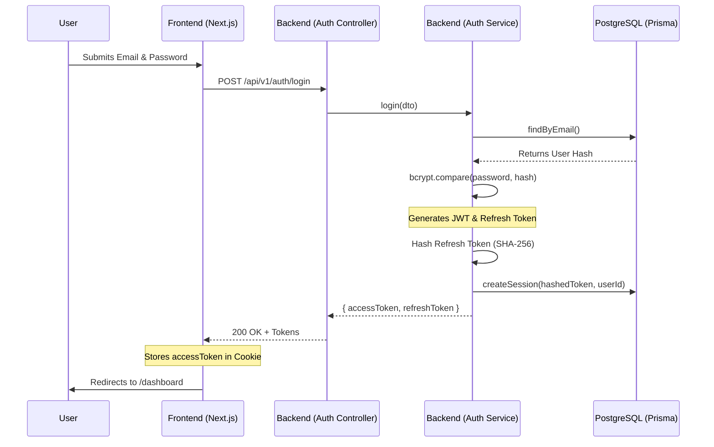
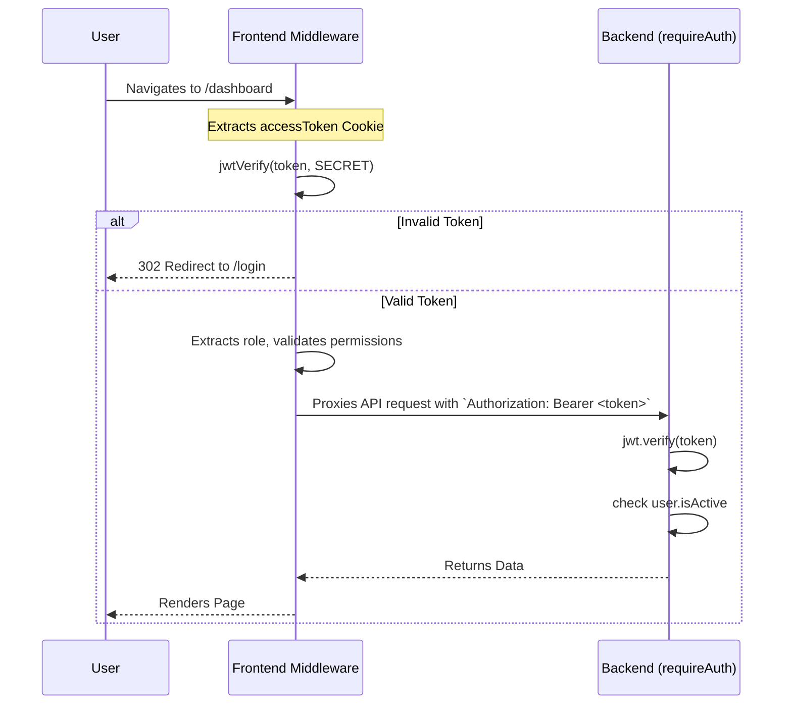

# Enterprise Ticket System - Authentication Flow

This document details the complete authentication lifecycle within the Enterprise Ticket System. It covers both the backend API architecture (token generation, hashing, sessions) and the frontend Next.js implementation (middleware, cookies, client-side requests).

---

## 🏗️ Architecture Overview

The authentication system is built on a **Stateful JWT Architecture**:
- **Access Tokens:** Stateless JSON Web Tokens (JWT) used for fast, localized route verification.
- **Refresh Tokens:** Opaque strings securely hashed and stored in the database, allowing for remote session revocation and reuse detection.

---

## 🔁 Request Flow Diagrams

### 1. Login & Token Generation Flow

### 2. Route Protection & API Validation Flow

---

## 📂 File Breakdown & Component Reasoning

### Backend Components

#### 1. `src/modules/auth/auth.service.ts`
- **Purpose:** The core business logic for authentication.
- **Key Features:**
  - **Password Hashing:** Uses `bcrypt` (cost factor 12) to securely hash passwords during registration and compare them during login.
  - **Token Generation:** Uses `jsonwebtoken` to generate the Access Token (containing `userId`, `role`, and `sessionId`), and `crypto.randomBytes(64)` to generate a secure, opaque Refresh Token.
  - **Session Hashing:** Hashes the Refresh Token via `crypto.createHash('sha256')` *before* storing it in the database. This ensures that if the database is compromised, the attacker cannot use the stolen hashes to forge new sessions.
  - **Security (Reuse Detection):** If a user attempts to refresh a token using an expired or already-invalidated refresh token, the service flags it as a security breach (`logger.warn`) and aggressively **revokes all active sessions** for that user to protect their account.

#### 2. `src/core/middlewares/requireAuth.ts`
- **Purpose:** Protects backend API routes.
- **Key Features:**
  - Extracts the token from the `Authorization: Bearer <token>` header.
  - Uses `jwt.verify` to decode it.
  - Fetches the user from the database to ensure `isActive` is true (handling scenarios where an Admin disables a user's account while their JWT is still technically unexpired).
  - Uses `express-http-context` to attach the user payload globally to the request thread for downstream services.

#### 3. `prisma/schema.prisma` (Session Model)
- **Purpose:** Stores stateful metadata for refresh tokens.
- **Fields:** `userId`, `refreshTokenHash`, `isValid`, `expiresAt`.
- **Reasoning:** By storing sessions in the database, administrators can force-logout users by flipping `isValid = false` or deleting the session, overriding the stateless nature of the JWT.

### Frontend Components

#### 4. `web/src/app/(auth)/login/page.tsx`
- **Purpose:** The UI layer for logging in.
- **Key Features:**
  - Validates inputs using `react-hook-form` and `zod`.
  - On successful login, it intercepts the `accessToken` from the API response and explicitly stores it in a browser cookie via `document.cookie`.
  - **Reasoning:** It sets `samesite=lax` and `path=/` so the cookie is securely sent with first-party navigation requests, allowing the Next.js Edge Middleware to read it on page transitions.
  - *(Note: While the backend returns a `refreshToken`, the frontend currently utilizes a simplified flow where the Access Token cookie is given a 7-day expiry `max-age=604800` to maintain the session).*

#### 5. `web/src/middleware.ts`
- **Purpose:** Next.js Edge Middleware acting as the first line of defense.
- **Key Features:**
  - Intercepts all page navigations and `/api/...` proxy requests.
  - Extracts the `accessToken` from cookies.
  - Uses `jose` (`jwtVerify`) to decrypt the token directly on Vercel's edge network.
  - **Role-Based Access Control (RBAC):** Immediately rejects non-admins attempting to access `/admin` paths, throwing a 403 or redirecting them without ever hitting the backend.
  - **Header Injection:** Appends the validated token to the request via `requestHeaders.set('Authorization', 'Bearer ' + accessToken)`. 
  - **Reasoning:** This is why the frontend `api.ts` `fetchClient` does not need to manually append the `Authorization` header—the Next.js middleware automatically intercepts outgoing requests to the backend and injects the header on the fly.

#### 6. `web/src/lib/api.ts`
- **Purpose:** The centralized data-fetching layer.
- **Key Features:** Provides `api.auth.login`, `api.auth.register`, and `api.auth.logout` wrappers to interact with the Next.js `/api/*` rewrite proxy.

---

## 🔒 Summary of Security Mechanisms
1. **No LocalStorage:** Access tokens are stored in Cookies rather than LocalStorage to mitigate XSS (Cross-Site Scripting) theft vectors.
2. **Double Validation:** Tokens are validated twice—first structurally by the Next.js Edge Middleware (for fast UI rendering and RBAC), and then definitively by the Express backend (which checks database revocation status).
3. **Database Compromise Protection:** Passwords are `bcrypt` hashed, and refresh tokens are `SHA-256` hashed. A raw database dump yields no usable credentials or session tokens.
4. **Token Hijacking Protection:** The refresh token rotation includes reuse-detection logic that immediately nukes all sessions if anomalous behavior is detected.
