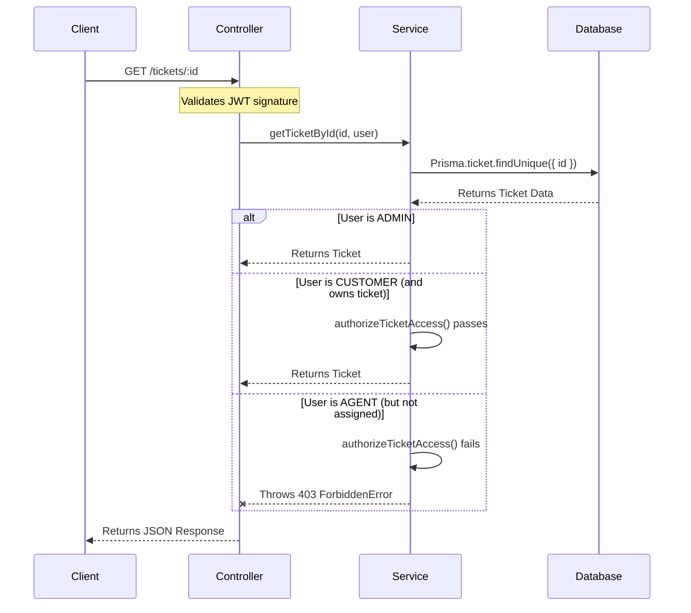

# Enterprise Ticket System - Authorization

This document details the authorization and access control architecture within the Enterprise Ticket System. It explains how Role-Based Access Control (RBAC), Middleware, and Service-level validations interact to secure data and prevent Insecure Direct Object Reference (IDOR) vulnerabilities.

---

## 👥 Roles & Permissions

The system operates on three strict hierarchical roles defined in the Prisma `Role` enum:

1. **`ADMIN`**:
   - **Permissions**: Unrestricted access. Can view and modify all tickets, reassign agents, view global analytics, manage users, and post internal notes.
2. **`AGENT`**:
   - **Permissions**: Restricted operational access. Can only access and modify tickets explicitly assigned to them. Cannot view other agents' tickets. Can post internal notes visible only to admins and agents.
3. **`CUSTOMER`**:
   - **Permissions**: Self-contained access. Can create tickets and view/reply ONLY to their own tickets. Cannot see internal notes or other customers' data.

---

## 🛡️ The Authorization Layers

Authorization is applied in a multi-layered approach to ensure overlapping security boundaries.

### Layer 1: Edge Router Middleware (`Next.js`)
Located in `web/src/middleware.ts`. 
Before a request ever reaches the backend, the edge network checks the JWT payload.
- If a `CUSTOMER` attempts to route to `/dashboard/agents` or `/dashboard/analytics`, the middleware instantly redirects them to the default dashboard.
- If a `CUSTOMER` attempts to hit an Admin-only API route (e.g., `/api/users/agents`), the middleware returns a `403 Forbidden` response without consuming backend resources.

### Layer 2: Controller Middleware (`requireRole`)
Located in `src/core/middlewares/requireAuth.ts`.
For backend routes that perform sensitive global actions, the controller injects a `requireRole` middleware array.
```typescript
router.get('/agents', requireRole(['ADMIN']), UsersController.getAgents);
router.get('/analytics', requireRole(['ADMIN']), AnalyticsController.getStats);
```
**Why:** This strictly blocks unauthorized roles from accessing administrative endpoints, even if they somehow bypassed the Edge Middleware.

### Layer 3: Service-Level Ownership Validation (`authorizeTicketAccess`)
Located in `src/modules/tickets/tickets.service.ts`.
Simply being an `AGENT` or `CUSTOMER` is not enough to view a ticket. The system must verify *ownership*.

```typescript
private static authorizeTicketAccess(user: AuthUser, ticket: any) {
  if (user.role === Role.ADMIN) return true;
  if (user.role === Role.CUSTOMER && ticket.customerId === user.userId) return true;
  if (user.role === Role.AGENT && ticket.assigneeId === user.userId) return true;
  throw new ForbiddenError('You do not have permission to access this ticket');
}
```

**Why (IDOR Prevention):** Without this function, an attacker logged in as a Customer could manually change the URL from `/api/v1/tickets/1` to `/api/v1/tickets/2` and read someone else's ticket. This is known as an Insecure Direct Object Reference (IDOR). `authorizeTicketAccess` prevents this by cross-referencing the requested object's foreign keys (`customerId` / `assigneeId`) against the requester's JWT `userId`.

---

## 🚦 Request Flow: Fetching a Ticket



---

## 🔐 Advanced Security Decisions

### 1. State Machine Transitions
In `tickets.service.ts`, there is a strict state machine validator: `validateStatusTransition()`.
- **Agents** can only transition tickets from `ASSIGNED` to `IN_PROGRESS`, or `IN_PROGRESS` to `RESOLVED`.
- **Customers** can only transition a ticket from `RESOLVED` to `CLOSED`.
- **Why:** This enforces the business logic that an Agent cannot unilaterally close a ticket without the Customer's consent, nor can a Customer randomly change a ticket's status back to `IN_PROGRESS` without submitting a reply.

### 2. Internal Notes Isolation
When fetching ticket replies, the service filters out internal notes if the requester is a Customer.
```typescript
if (user.role === Role.CUSTOMER) {
  replies = replies.filter(reply => !reply.isInternal);
}
```
- **Why:** Ensures that sensitive internal staff deliberations regarding a ticket are mathematically impossible to leak to the frontend customer view, regardless of UI bugs.

### 3. Customer Isolation (Listing Tickets)
When the `listTickets` function is called, the database query is dynamically constrained based on the JWT role:
- **Admin**: Query is `{}` (Gets all).
- **Agent**: Query is `{ assigneeId: user.userId }` OR `{ status: 'OPEN', assigneeId: null }` (Agent can see their tickets + unassigned queue).
- **Customer**: Query is `{ customerId: user.userId }`.
- **Why:** Prevents mass data scraping. A compromised Customer token can only ever fetch data explicitly tied to that Customer's ID.
