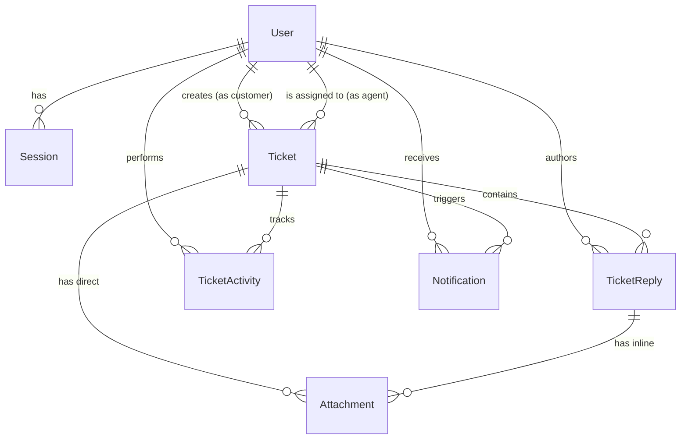

# Enterprise Ticket System - Database Documentation

This document provides a comprehensive overview of the PostgreSQL database schema defined via Prisma ORM for the Enterprise Ticket System. It explains the purpose, fields, relationships, and application usage of each table and enum.

---

## 🗺️ Entity Relationship Diagram

---

## 📚 Enums

### 1. `Role`
Defines the access level and permissions of a User.
- **ADMIN**: Full system access, can manage agents, view all analytics, and alter system settings.
- **AGENT**: Support staff who can view, claim, reply to, and resolve assigned or open tickets.
- **CUSTOMER**: End-users who can only create tickets and view/reply to their own tickets.

### 2. `TicketStatus`
Tracks the current lifecycle state of a ticket.
- **OPEN**: Newly created, awaiting initial agent response.
- **IN_PROGRESS**: Being actively worked on by an assigned agent.
- **RESOLVED**: Agent has provided a solution, awaiting customer confirmation.
- **CLOSED**: Issue is confirmed resolved and the ticket is locked.

### 3. `Priority`
Helps agents triage tickets based on urgency.
- **LOW**, **MEDIUM**, **HIGH**, **URGENT**

### 4. `ActivityType`
Used for audit logging to track exactly what happened to a ticket and when.
- **CREATED**, **ASSIGNED**, **REASSIGNED**, **STATUS_CHANGED**, **CLOSED**, **REOPENED**, **REPLIED**

### 5. `NotificationType`
Determines the context of an in-app notification.
- **TICKET_ASSIGNED**: Agent assigned to a ticket.
- **CUSTOMER_REPLY**: Customer replied to an agent's ticket.
- **AGENT_REPLY**: Agent replied to a customer's ticket.
- **INTERNAL_NOTE**: Agent left a private note for other agents.
- **TICKET_RESOLVED**: Ticket was marked resolved.

---

## 🗄️ Models

### 1. `User`
**Purpose:** The central identity model. Represents anyone who interacts with the system (Customers, Agents, Admins).

**Fields:**
- `id` (String/UUID): Primary key.
- `email` (String): Unique identifier used for authentication and communications.
- `passwordHash` (String): Securely hashed password for local authentication.
- `name` (String): Display name for the UI.
- `role` (Role): Enum defining authorization boundaries (Default: `CUSTOMER`).
- `isActive` (Boolean): Soft-delete/suspension flag. Prevents disabled users from logging in without destroying their relational data.
- `createdAt` / `updatedAt` (DateTime): Auditing timestamps.

**Relationships:**
- Has many `Session`s (Active logins).
- Has many `Ticket`s via `ticketsCreated` (If customer).
- Has many `Ticket`s via `ticketsAssigned` (If agent).
- Has many `TicketReply`s, `TicketActivity` logs, and `Notification`s.

**Usage:**
- **Services:** `UsersService` (CRUD), `AuthService` (Authentication logic), `TicketsService` (Validating assignees).
- **Controllers:** `UsersController` (Profile/Agent management), `AuthController` (Login/Register).

### 2. `Session`
**Purpose:** Manages secure, stateful JWT refresh token sessions, allowing users to stay logged in securely and allowing admins to revoke sessions remotely.

**Fields:**
- `id` (String/UUID): Primary key.
- `userId` (String): Foreign key to `User`.
- `refreshTokenHash` (String): Hashed version of the long-lived refresh token sent to the client. Hashed to prevent theft if the database is compromised.
- `isValid` (Boolean): Flag to instantly invalidate a session upon logout or security breach.
- `expiresAt` (DateTime): Absolute expiration date of the refresh token.

**Relationships:**
- Belongs to one `User`.

**Usage:**
- **Services:** `AuthService` (Creating sessions on login, validating on token refresh, invalidating on logout).
- **Controllers:** `AuthController`.

### 3. `Ticket`
**Purpose:** The core domain entity of the application. Represents a customer support request or issue.

**Fields:**
- `id` (String/UUID): Primary key.
- `ticketNumber` (String): Human-readable unique identifier (e.g., TKT-1001) used in UI and emails.
- `subject` (String): Brief summary of the issue.
- `description` (Text): The initial detailed request from the customer.
- `status` (TicketStatus): Lifecycle state.
- `priority` (Priority): Triage weight.
- `customerId` (String): Foreign key to the `User` who created it.
- `assigneeId` (String?): Optional foreign key to the `User` (Agent) currently handling it.
- `closedAt`, `deletedAt` (DateTime?): Timestamps for SLA tracking and soft-deletion.

**Relationships:**
- Belongs to a customer (`User`).
- Belongs to an assignee (`User?`).
- Has many `TicketReply`s, `Attachment`s, `TicketActivity` logs, and `Notification`s.

**Usage:**
- **Services:** `TicketsService` (Business logic for creation, assignment, resolution), `AnalyticsService` (Calculating response times, resolution rates).
- **Controllers:** `TicketsController`, `AnalyticsController`.

### 4. `TicketReply`
**Purpose:** Stores the conversation thread within a ticket, allowing back-and-forth communication between customers and agents.

**Fields:**
- `id` (String/UUID): Primary key.
- `ticketId` (String): Foreign key to the parent `Ticket`.
- `userId` (String): Foreign key to the `User` authoring the reply.
- `message` (Text): The content of the reply.
- `isInternal` (Boolean): If `true`, the reply is a private note visible only to Agents/Admins, completely hidden from the Customer.

**Relationships:**
- Belongs to a `Ticket` and a `User`.
- Has many inline `Attachment`s.

**Usage:**
- **Services:** `TicketsService` (Handling reply creation and triggering notifications/activity logs).
- **Controllers:** `TicketsController`.

### 5. `TicketActivity`
**Purpose:** An immutable audit log. Crucial for enterprise software to maintain a history of "who did what and when" for accountability and SLA metrics.

**Fields:**
- `id` (String/UUID): Primary key.
- `ticketId` (String): Foreign key to the affected `Ticket`.
- `actorId` (String?): Foreign key to the `User` who performed the action (can be null for system-automated actions).
- `type` (ActivityType): What action occurred (e.g., `STATUS_CHANGED`).
- `details` (Text?): Granular JSON or text details (e.g., "Changed status from OPEN to IN_PROGRESS").

**Relationships:**
- Belongs to a `Ticket` and an `actor` (`User`).

**Usage:**
- **Services:** `TicketsService` (Appends logs during mutations), `AnalyticsService` (Scans logs to calculate metric SLAs like Time-To-First-Response).
- **Controllers:** `TicketsController` (GET `/tickets/:id/activities`).

### 6. `Attachment`
**Purpose:** Handles file metadata for user uploads (screenshots, documents).

**Fields:**
- `id` (String/UUID): Primary key.
- `ticketId` (String?): Links file directly to the main ticket description.
- `replyId` (String?): Links file to a specific reply in the thread.
- `filename` (String): Original file name.
- `url` (String): Cloud storage URL (e.g., AWS S3 bucket link) where the actual file resides.
- `mimeType` & `size` (String/Int): File metadata for UI rendering and validation.

**Relationships:**
- Belongs to `Ticket` OR `TicketReply`.

**Usage:**
- **Services:** `TicketsService` (Associating files during ticket/reply creation).
- **Controllers:** `TicketsController`.

### 7. `Notification`
**Purpose:** Powers the real-time alerting system to keep users engaged without requiring them to poll their emails.

**Fields:**
- `id` (String/UUID): Primary key.
- `userId` (String): Foreign key to the `User` receiving the alert.
- `ticketId` (String): Foreign key to the related `Ticket` for deep-linking.
- `title` & `message` (String/Text): UI display content.
- `type` (NotificationType): Used by the frontend to display appropriate icons (e.g., a warning icon vs an info icon).
- `isRead` (Boolean): Tracks whether the user has viewed the notification to display the red "unread" badge.

**Relationships:**
- Belongs to a `User` (recipient) and a `Ticket` (context).

**Usage:**
- **Services:** `NotificationsService` (CRUD and unread counts), `TicketsService` (Fires off notifications when a ticket is assigned or replied to).
- **Controllers:** `NotificationsController`.

---

## 🏛️ Schema Design Principles

1. **Auditability:** The `TicketActivity` model enforces enterprise accountability. Instead of just updating a ticket row, every state mutation inserts an immutable activity log. This is critical for SLA reporting.
2. **Security via Soft Deletion:** `User` records rely on `isActive`, and `Ticket` records rely on `deletedAt`. In relational databases, hard-deleting users destroys foreign keys in historical tickets. Soft-deleting preserves historical reporting metrics.
3. **Optimized Indexing:** The schema includes extensive `@@index` directives on frequently queried combinations (e.g., `@@index([assigneeId, status])`). This ensures dashboard API calls (like "Fetch all OPEN tickets assigned to Agent X") run instantly, even at massive scale.
4. **Internal Visibility Boundaries:** The `isInternal` flag on `TicketReply` allows support teams to collaborate behind the scenes on a single thread without needing a separate communication channel.
5. **Cascading Deletes:** `onDelete: Cascade` is strategically applied to downstream entities (like `Session`, `Notification`, and `TicketReply`). If a parent Ticket or User is ever permanently purged (e.g., for GDPR compliance), all associated heavy data is automatically cleaned up by PostgreSQL, preventing orphaned records.
