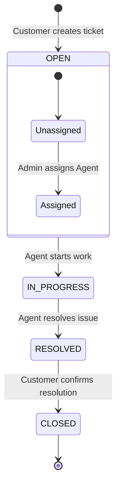
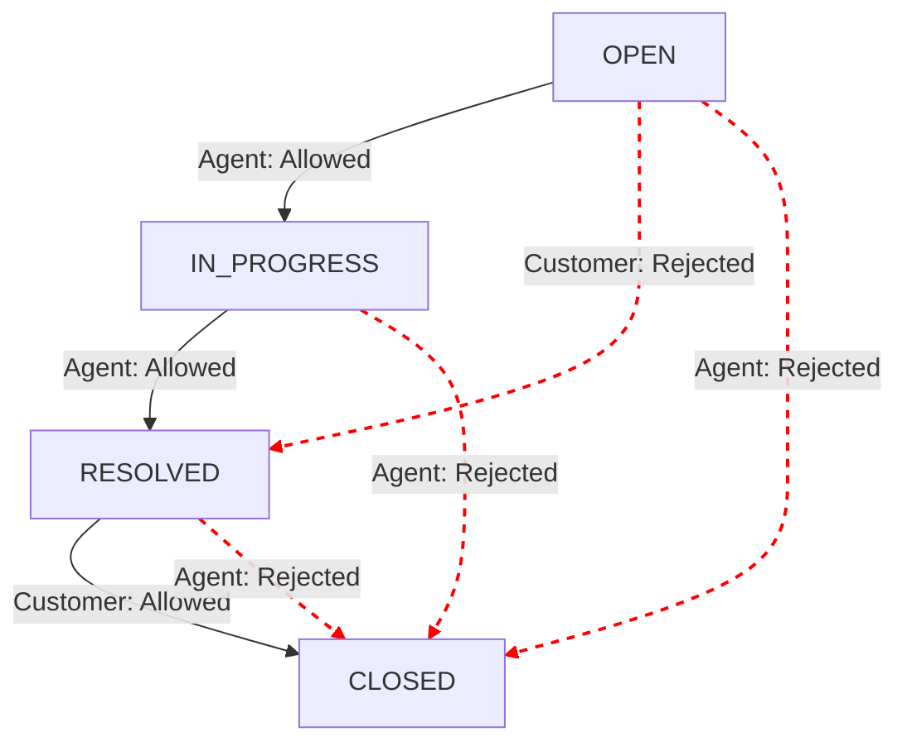

# Ticket Lifecycle Documentation

This document explains the strict state machine and lifecycle of a support ticket in the Freshworks Ticket System. It covers role-based validations, state transitions, and the immutable activity logging that tracks these changes.

---

## The Ticket Lifecycle Flow

The typical lifecycle of a ticket follows a linear progression from creation to closure.



### 1. Creation (`OPEN`)
- **Actor:** Customer
- **Action:** A customer submits a new support request.
- **Role Validation:** Enforced in `TicketsController.createTicket`. Only authenticated users with the `CUSTOMER` role can perform this action.
- **State:** The ticket is created with a default status of `OPEN` and `assigneeId` set to `null`.
- **Activity Log:** `ActivityType.CREATED` ("Ticket created") is recorded.

### 2. Assignment
- **Actor:** Admin
- **Action:** An administrator reviews the open ticket and assigns it to a specific support agent.
- **Role Validation:** Enforced via `requireRole(['ADMIN'])` middleware on the `PATCH /:id/assign` route.
- **State:** Status remains `OPEN`, but `assigneeId` is updated to the Agent's User ID.
- **Activity Log:** `ActivityType.ASSIGNED` ("Assigned to [Agent ID]") is recorded.

### 3. Starting Work (`IN_PROGRESS`)
- **Actor:** Agent (or Admin)
- **Action:** The assigned agent acknowledges the ticket and begins working on it.
- **Role Validation:** Agents can only update tickets where `ticket.assigneeId === user.userId`. Admins can update any ticket.
- **State Transition:** Status changes from `OPEN` -> `IN_PROGRESS`.
- **Activity Log:** `ActivityType.STATUS_CHANGED` ("Status changed from OPEN to IN_PROGRESS") is recorded.

### 4. Resolution (`RESOLVED`)
- **Actor:** Agent (or Admin)
- **Action:** The agent provides a solution to the customer and marks the ticket as resolved.
- **Role Validation:** Agents can only update their assigned tickets.
- **State Transition:** Status changes from `IN_PROGRESS` -> `RESOLVED`.
- **Activity Log:** `ActivityType.STATUS_CHANGED` ("Status changed from IN_PROGRESS to RESOLVED") is recorded.

### 5. Closure (`CLOSED`)
- **Actor:** Customer
- **Action:** The customer verifies the solution works and formally closes the ticket.
- **Role Validation:** Customers can only update tickets where `ticket.customerId === user.userId`.
- **State Transition:** Status changes from `RESOLVED` -> `CLOSED`. The `closedAt` timestamp is populated.
- **Activity Log:** `ActivityType.CLOSED` ("Status changed from RESOLVED to CLOSED") is recorded.

---

## State Machine: Allowed & Rejected Transitions

The backend strictly enforces a state machine inside `TicketsService.validateStatusTransition()`. Direct API manipulation to bypass the workflow is blocked.

### Allowed Transitions
| Actor | Current Status | New Status | Condition |
| :--- | :--- | :--- | :--- |
| **Agent / Admin** | `OPEN` | `IN_PROGRESS` | Ticket must be assigned to an agent (`assigneeId !== null`). |
| **Agent / Admin** | `IN_PROGRESS` | `RESOLVED` | Normal workflow progression. |
| **Customer** | `RESOLVED` | `CLOSED` | Customer accepts the resolution. |

### Rejected Transitions (Throws `409 ConflictError`)
The system explicitly rejects the following invalid workflow jumps:

- **Customer trying to resolve a ticket:** Customers are blocked from transitioning `OPEN` -> `RESOLVED`. They can only close a ticket that an agent has already resolved.
- **Agent closing a ticket:** Agents cannot force a ticket to `CLOSED`. The customer must verify the fix.
- **Skipping states:** Agents cannot move a ticket directly from `OPEN` to `RESOLVED` without going through `IN_PROGRESS`.
- **Working on unassigned tickets:** An agent cannot move a ticket to `IN_PROGRESS` if it has not been assigned by an Admin (`assigneeId === null`).



---

## Activity Logging (Audit Trail)

To ensure accountability, every state transition and lifecycle event triggers an immutable record in the `TicketActivity` table. 

This logic is executed concurrently with the state change in `TicketsService`.

```typescript
// Example from TicketsService.updateStatus
let activityType: ActivityType = ActivityType.STATUS_CHANGED;
if (data.status === TicketStatus.CLOSED) activityType = ActivityType.CLOSED;
if (ticket.status === TicketStatus.CLOSED && data.status !== TicketStatus.CLOSED) activityType = ActivityType.REOPENED;

await activityRepo.create({
  ticketId,
  actorId: user.userId,      // The user making the change
  type: activityType,        // Enum (CREATED, ASSIGNED, STATUS_CHANGED, CLOSED, REPLIED)
  details: `Status changed from ${ticket.status} to ${data.status}`,
});
```

Because these logs are immutable and tracked by `actorId`, system administrators can perfectly reconstruct the history of a ticket, determining exactly *who* changed a status and *when* it occurred.
